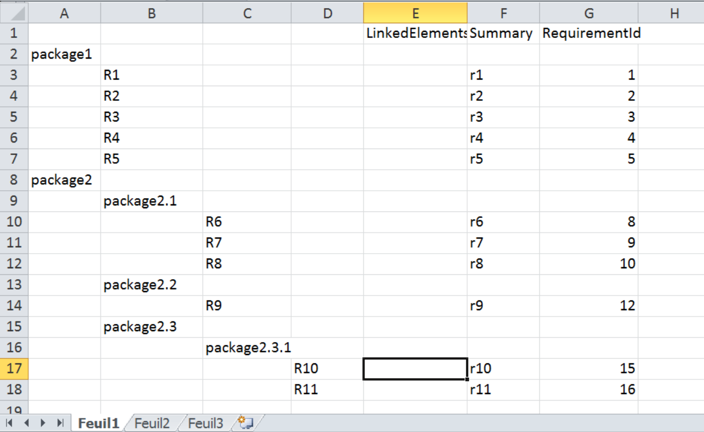
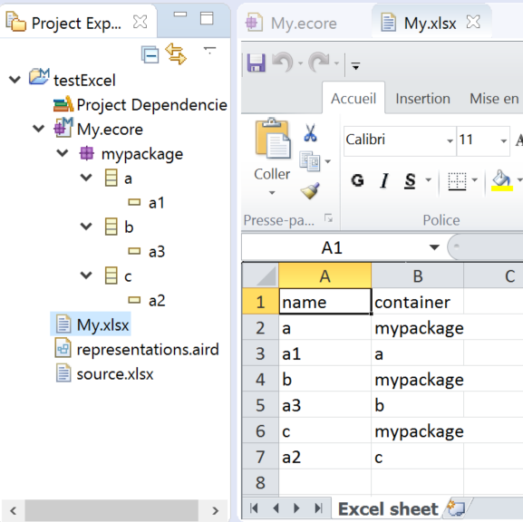

This directory contains a set of examples for EMFSpreadsheetIO. 

**com.thalesgroup.clarity.excelimport.examples**: A set of two import examples, to present how to manage 
hierarchical import. 
The first one is about requirement management, and setting attributes on requirement elements.

The second one is onn hierarchical imports, but it also add the management of links between elements 
created by the import, using the importEnded method, and how to ensure an update of your model if you are
importing update versions of the xls file. 

**org.obeonetwork.spreadsheet.exporter.mm.capella**:

**org.obeonetwork.spreadsheet.importer.capella.example**:

**org.obeonetwork.spreadsheet.importer.ecore.example**: an example based on ecore. The excel file contains a 
list of metaclasses, with, for each one, its abstractness and its inheritance.

**org.obeonetwork.spreadsheet.examples.mmext**: an exemple, based on ecore for the generation with a metamodel extension
to implements a relationship to eContainer

