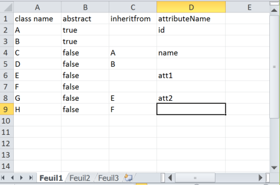

This directory contains a set of examples for EMFSpreadsheetIO. 

**com.thalesgroup.clarity.excelimport.examples**: 

**org.obeonetwork.spreadsheet.exporter.mm.capella**:

**org.obeonetwork.spreadsheet.importer.capella.example**:

**org.obeonetwork.spreadsheet.importer.ecore.example**: an example based on ecore. The excel file contains a 
list of metaclasses, with, for each one, its abstractness and its inheritance.

